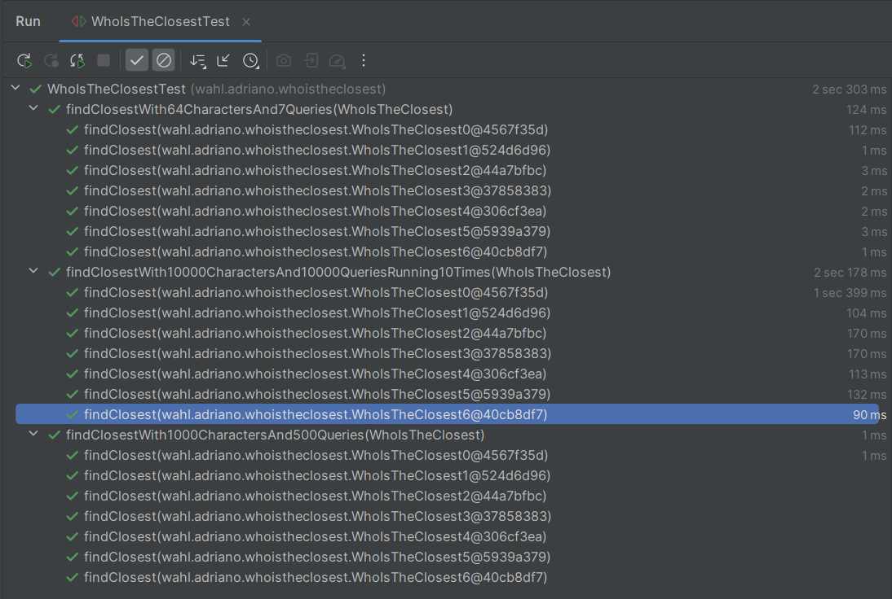
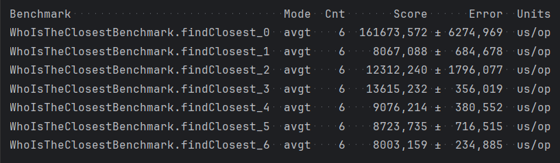

# Who is the closest?

Given a string s and a list of integer queries, return an array answer, where `answer[i]` is the closest index with a
repetition of the character in `s[query]`.

- `s` contains only lowercase letters (ascii a-z)
- `s` is between 1 and 105 characters long
- `queries` are in the range of `[0, s.length - 1]`
- `queries` list's length is between 1 and 105
- if there is no repetition of the character queried in `s`, answer[i] == -1
- if there are 2 equidistant repetitions of the character queried in `s`, the smallest index is the closest

# Example

- s: "araras", queries: [1, 2, 5]
- answer: [3, 0, -1]

# Variables

- n: length of s
- m: number of queries
- k: number of occurrences of the same character in s

# Implementations

I wrote an interface to the solution of this problem and implemented it in 6 classes numbered from 0 to 5 (from
theoretical slowest to fastest). Asymptotic analysis done with Big O. Time complexity was done by average case analysis.

The solutions are as follows:

- `WhoIsTheClosest0` is the naivest (and slowest) implementation, scanning all characters of the string for each query,
running in **O(n * m)** time and **O(1) additional space**.

- `WhoIsTheClosest1` is faster at finding the closest character (O(log n)) by starting at the queries character and
expanding in both directions (two pointers technique), running in **O(m log n) time** and **O(1) additional space**.

- `WhoIsTheClosest2` evolves by first mapping out all repetitions of the characters in the string (O(n)), but searches
for the closest scanning all the repetitions (O(k)), running in **O(n + m * k) time** and **O(n) additional space**.

- `WhoIsTheClosest3` goes a step forward by deciding in O(1) the closest character (it's either left or right), but it
still takes O(k) to search for the position of the queried character in the list of repetitions, so the overall
complexity is the same as the previous implementation, running in **O(n + m * k) time** and **O(n) additional space**.

- `WhoIsTheClosest4` is faster than the previous implementation, because it uses binary search to find the position of
the queried character in the list of repetitions, which is O(log k), so running in **O(n + m * log k) time** and **O(n)
additional space**.

- `WhoIsTheClosest5` evolves over the last implementation by saving the answers for each query in an array, so
that repeated queries are solved in O(1) time at the cost of adding O(n) space. It adds some advantages with
little overhead, not even changing big O values. Overall it runs in **O(n + m * log k) time** and **O(n) additional
space**.

- `WhoIsTheClosest6` is a linear solution, using the hash map solution, but solving the closest characters in a single
pass even solving for indexes that may not be queried. This is achieved by iterating over the mapped out indexes for
each character and deciding for each if the right or left one is the closest and saving it to an array. This solution
runs in **O(n + m) time** and **O(n) additional space**.

# Tests

I wrote 3 parametrized test cases to validate all the solutions with different magnitudes.
All of them passed with all solutions!
The most relevant for looking at the speed of the algorithms tests is the longest one, with 105 characters and
queries. It runs 10 times in a loop in order to extrapolate the numbers.
In my scenario, `WhoIsTheClosest6` was the fastest implementation, as can be seen in the image:

However, these tests are not as accurate for benchmarking, because there might be JVM optimization, OS activities,
lack of warmup and many other factors in play.

# Benchmarks

To get more reliable benchmarks, I used JMH (Java Microbenchmark Harness) because it addresses problems aforementioned
and provides a controlled environment.
I used the same data set as in the longest test for the microbenchmarking.
The results are in microseconds as follows:

The fastest implementation was `WhoIsTheClosest6` (linear), followed closely by `WhoIsTheClosest1` (logarithmic).

# Conclusion

The solution with the best asymptotic analysis was also the fastest on the benchmarks. And since linear time complexity
was reached, it's probably an optimal solution to this problem, being hard to make it run much faster.
